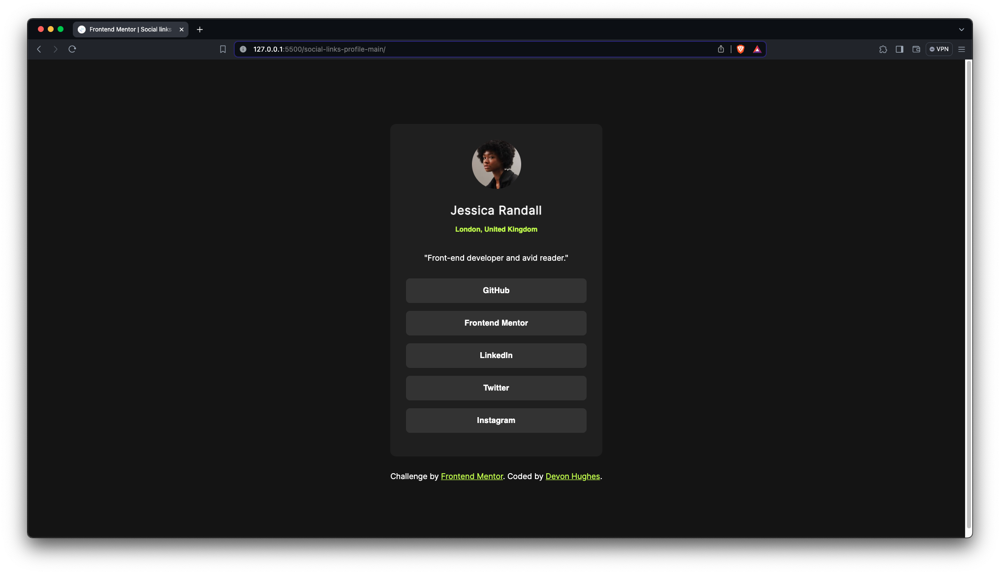
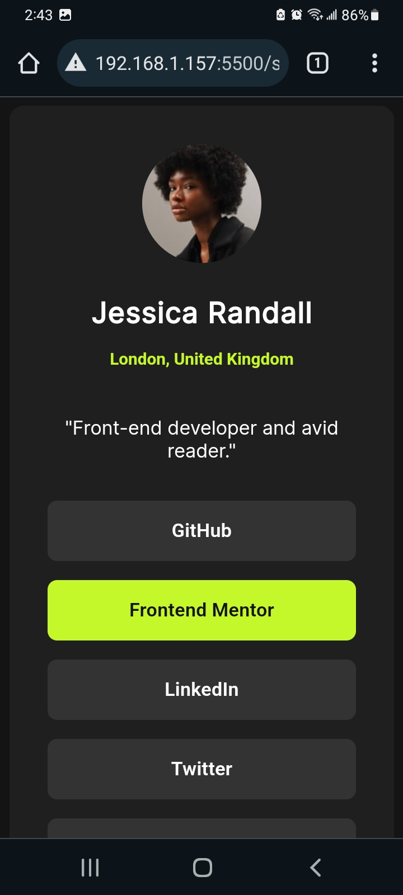

# Frontend Mentor - Social links profile solution

This is a solution to the [Social links profile challenge on Frontend Mentor](https://www.frontendmentor.io/challenges/social-links-profile-UG32l9m6dQ). Frontend Mentor challenges help you improve your coding skills by building realistic projects. 

## Table of contents

- [Overview](#overview)
- [The challenge](#the-challenge)
- [Screenshot](#screenshot)
- [Links](#links)
- [Built with](#built-with)
- [Continued development](#continued-development)
- [Author](#author)

## Overview

My solution to the Social Links Profile challenge.

### The challenge

Users should be able to:

- See hover and focus states for all interactive elements on the page

### Screenshot

### Links

- Solution URL: (https://github.com/DevonHughesCodes/Social-links-profile-solution)
- Live Site URL: (https://devonhughescodes.github.io/Social-links-profile-solution/)

### Built with

- Semantic HTML5 markup
- CSS custom properties
- Flexbox
- Visual Studio Code

### Continued development

JavaScript, React, Python, Vue.js

## Author

- CodePen - [Devon Hughes](https://codepen.io/Devon-Hughes-the-decoder)
- Frontend Mentor - [@DevonHughesCodes](https://www.frontendmentor.io/profile/DevonHughesCodes)
- Twitter - [@HughesDevDesign](https://twitter.com/HughesDevDesign)